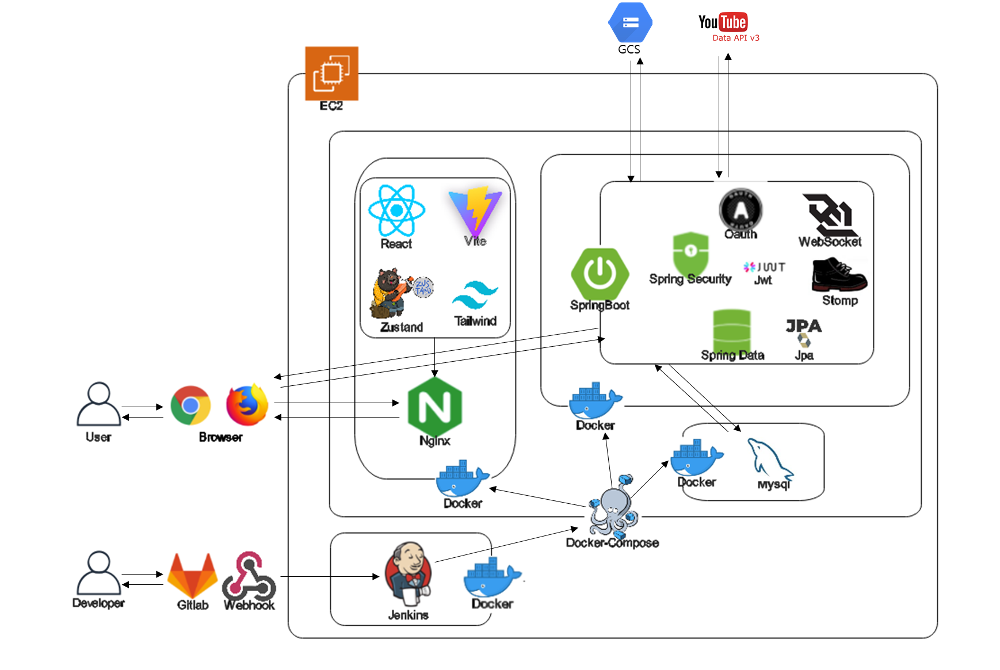

# 💻 온라인 강의 스터디 모임은, 쓰임!


## 🎞 소개 영상 보기 : [UCC 링크](https://youtu.be/aAv_wc749fQ)

## 📆 프로젝트 진행 기간

2023.01.16(월) ~ 2023/02/17(금)

SSAFY 8기 2학기 공통프로젝트 - 쓰임

## 📖 쓰임은 무엇인가요?

### ✊WHY? - 쓰임의 비전

**한국의 모든 취준생의 고독을 해결하고 싶다!!**

### 🤔HOW? - 쓰임의 방향

취준생이라면 누구든, **같은 목표를 가진 사람들과 함께 교류**할 수 있는 곳을 만들고 싶었어요

취준에 있어 전의를 상실하지 않도록 **동기부여**가 되는 곳을 만들고 싶었어요

선례가 되는 현업자의 조언 또는 같은 공부를 하는 다른 취준생들을 바탕으로 **취준을 위해 필요한 것들을 다시금 확인**하고 싶었어요

### 🙌WHAT? - 쓰임의 가치

**온라인 강의라는 공통 관심사를 통해 교류, 동기부여, 성장할 수 있는 플랫폼**

## 💜 주요 기능

### 🔎 강좌 목록 및 검색

나에게 도움이 되는 **강좌를 찾고 분류 별로 모아볼 수 있어요**

### ❤ 강좌 좋아요 및 저장

내가 좋아하는 강좌나 보고싶은 강좌를 **좋아요 표시할 수 있어요**

**좋아요를 표시한 강좌**들은 **마이페이지에서 모아볼 수 있어요**

### 📽 강좌 플레이어

유튜브 영상을 **큰 화면으로 시청할 수 있어요**

### 🗒 강좌 플레이어 메모

강의를 듣다가 남겨두고 싶은 메모가 있다면 **비디오 플레이어의 사이드 메뉴**에서 **메모를 작성할 수 있어요**

**마크다운 형식**으로 깔끔하게 정리한 메모를 저장하고 필요할 때마다 **마이페이지에서 언제든 확인할 수 있어요**

### 🙋‍♀️ 강좌 플레이어 질문 게시판

강좌를 듣다가 궁금한게 생겼을 때 나와 같은 궁금증이 생긴 사람들의 **질문을 찾아볼 수 있어요**

강좌를 들으며 궁금한게 생기면 **즉시 질문을 남길 수 있고 답변을 받을 수 있어요**

### 👣 사용자 히스토리

내가 **최근 수강한 강좌와 강의들이 기록**되어 **마이페이지에서 확인할 수 있어요**

최근 듣던 강의를 이어서 듣는다면 **이전 플레이어를 종료한 위치부터 이어서 시청할 수 있어요**

### ✒ 스터디 생성 및 모집

같은 강좌를 듣거나 같은 분야를 공부하는 사람들과 함께 **스터디를 진행할 수 있어요**

내가 공부하고 싶은 **강좌들을 모아 커리큘럼으로 등록**하고 스터디원을 모을 수 있어요

### 👨‍👧‍👦 스터디 커뮤니티

**스터디 커뮤니티에 글을 남겨** 스터디원들과 간단한 대화가 가능해요

### 📡 실시간 강의 시청 및 채팅

스터디원들과 **실시간으로 강의를 시청할 수 있어요**

강의 영상 싱크는 스터디원 모두와 동기화 되어 **같은 시간대의 영상을 동시에 시청할 수 있어요**

강의를 시청하며 궁금한 것이 생기면 **스터디원들과 실시간으로 공유하고 채팅할 수 있어요**

### 📼 스터디 히스토리

스터디원들과 함께 **실시간으로 시청했던 강의의 내역을 볼 수 있어요**

### ❔ 질문 게시판

쓰임을 사용하는 사람들이 강의를 들으며 궁금했던 **질문들을 모아볼 수 있어요**

**질문에 답변을 남긴다면** 질문자에게 큰 도움이 될 수 있어요

### 🎤 자유 게시판

쓰임을 사용하는 **모든 사람들에게 글을 게시할 수 있어요**

**특정 강의와 관련 없이 궁금한게 생긴다면,** 자유게시판에 글을 작성해볼 수 있어요

**댓글을 남겨** 게시글에 대한 생각을 표현해주세요

### 💑 사용자 팔로우

**내가 친해지고 싶은 사람을 팔로우**하고, **나에게 관심있는 사람에게 팔로잉** 받을 수 있어요

## 🛠 주요 기술

| Frontend   | Backend - Spring            | CI/CD          |
| ---------- | --------------------------- | -------------- |
| React      | Spring Boot                 | AWS EC2        |
| Vite       | Spring Web                  | Jenkins        |
| Zustand    | Spring WebSocket with STOMP | Docker         |
| Tailwind   | JPA                         | Docker Compose |
| TypeScript | JWT                         | NginX          |
|            | Spring Security             |                |
|            | Spring Data with Swagger    |                |
|            | Google Cloud Storage        |                |
|            | Youtube API                 |                |
|            | MySQL 8                     |                |

## ⚒ 프로젝트 아키텍쳐




## 🖥️ 쓰임 서비스 화면 
### 0. 회원가입
 

### 1. 메인화면 

| <로그인 전>                                                  | <로그인 후>                                                  |
| ------------------------------------------------------------ | ------------------------------------------------------------ |
|  |  |
| 전체 강좌, 모집 중인 스터디, 자유/강의 질문을 볼 수 있습니다. | **관심 태그를 기반으로 한 추천강좌**가 뜨게 됩니다.          |
| 메인 화면의 글을 클릭하면 로그인 모달이 뜨게 됩니다.         | **내 스터디**와 자유 **질문** / 강의 질문이 뜨게 됩니다.     |

### 2. 강좌 

##### 2-1. 강좌 메인 페이지

- 강좌 페이지 배너에는 **관심 태그를 기반으로 한 추천 강좌**가 뜨게 됩니다. 강좌 들으러 가기를 누르면 해당 강좌 상세 페이지로 이동합니다.
- 전체 강좌는 페이지네이션으로 한 페이지에 8개의 강좌를 볼 수 있습니다. 


##### 2-2. 강좌 상세 페이지

- 강좌 상세 페이지에서는 해당 **강좌가 포함하는 강의 목록**을 볼 수 있고 재생 버튼을 누르면 해당 강의의 비디오 플레이어로 이동합니다.
- **스터디 탭**을 누르면 해당 **강좌를 포함하고 있는 스터디**가 보여지고 **커뮤니티**에는 해당 강좌에 포함된 **강의에 남긴 질문**들을 모아볼 수 있습니다. 
- 강좌에는 **좋아요**를 남길 수 있고 마이페이지에서 좋아요한 강좌를 모아볼 수 있습니다. 

| <강좌 상세 페이지 메인>                                      | <강좌를 수강하는 스터디>                                     | <강좌 관련 커뮤니티글>                                       |
| ------------------------------------------------------------ | ------------------------------------------------------------ | ------------------------------------------------------------ |
|  |  |  |


### 3. 스터디

##### 3-1. 스터디 메인 & 구인

| <스터디 구인 메인 페이지>                                    | <스터디 신청>                                                |
| ------------------------------------------------------------ | ------------------------------------------------------------ |
|  |  |
| 현재 구인 중인 스터디 목록이 뜹니다.                         | 모집방법이 **신청**인 경우에는 스터디를 만든 **방장에게 메시지**를 보내고 방장이 수락을 해야 스터디에 참여할 수 있습니다. |
| 구인 페이지에 띄우고 싶지 않다면 스터디 진행을 종료로 바꾸거나 모집 여부를 모집 마감으로 바꾸면 됩니다. | 모집방법이 **공개**인 경우에는 **신청 버튼**을 누르면 바로 스터디에 참여할 수 있습니다. |

| <스터디 구인글 생성하기>                                     | <스터디 구인글 수정>                                         |
| ------------------------------------------------------------ | ------------------------------------------------------------ |
|  |  |
| 스터디 정보를 포함한 구인글 작성할 수 있습니다.              | 스터디 메인 혹은 스터디 구인 상세 페이지에서 스터디 정보를 수정할 수 있습니다. |
| 모집 방법을 신청으로 선택할 경우에는 스터디 구인글을 쓴 사람에게 신청글을 남겨서 수락을 해야 스터디에 참여할 수 있습니다. |                                                              |


##### 3-2. 스터디 페이지 

- 스터디에 신청을 완료했다면 마이페이지 혹은 메인 페이지의 내 스터디 바로가기에서 스터디 메인 페이지로 들어갈 수 있습니다.  
- 방장의 경우 추가적으로 공지사항 작성 / 커리큘럼 수정 / 회원 탈퇴 / 회원 신청 수락 / 스터디 정보 수정이 가능합니다. 

| <팀원 페이지>                                                | <팀장 페이지>                                                |
| ------------------------------------------------------------ | ------------------------------------------------------------ |
|  |  |

| <스터디 신청 수락>                                           | <커리큘럼 수정>                                              |
| ------------------------------------------------------------ | ------------------------------------------------------------ |
|  |  |


### 3-3. 스터디 플레이어 

- 스터디 시간이 되었다면 스터디원 중 아무나 스터디 플레이어를 열 수 있습니다. 이미 한 명이 스터디를 시작했다면 팀원들은 스터디 페이지의 '스터디 참여' 를 누르면 바로 스터디를 참여할 수 있습니다.
- **실시간 플레이어 공유**가 가능하고 시간을 옮길 경우 스터디원 모두에게 적용됩니다. 
- 스터디원들과 **실시간 채팅**이 가능합니다. 
- 강의를 듣다가 모르는 것이 생겼을 경우 **질문목록에서 질문**을 남길 수 있습니다.
- 강의를 듣다가 메모를 남길 수 있습니다. **메모는 마크다운 형식**으로 가능합니다.  

| <스터디 메인 페이지>                                         | <스터디 싱크 조정>                                           |
| ------------------------------------------------------------ | ------------------------------------------------------------ |
|  |  |

### 4. 커뮤니티 

##### 4-1. 커뮤니티 메인 & 글 작성 

- 커뮤니티 페이지에서는 **자유 질문과 강의 질문**으로 나뉘어져 있고 둘 다 **각각의 탭에서 검색이 가능**합니다. 
- **자유 질문 글쓰기는 자유 질문 탭에서 가능**하고 **강의 질문은 각각의 강의 플레이어 내**에서 질문을 남기는 것이 가능합니다. 
- 게시물들은 기본적으로 최신순으로 정렬이 되어 있고 최신순, 오래된순, 조회높은순, 조회낮은순으로 **정렬이 가능**합니다.

| <커뮤니티 메인 페이지>                                       | <글 작성 페이지>                                             |
| ------------------------------------------------------------ | ------------------------------------------------------------ |
|  |  |

##### 4-2. 커뮤니티 상세 페이지 

- 게시물과 동영상 플레이어에서는 댓글 남기기가 가능합니다. 
- 또한 본인이 남긴 게시물의 경우 수정, 삭제가 가능합니다. 

| <댓글 작성>                                                  | <글 수정>                                                    | <글 삭제>                                                    |
| ------------------------------------------------------------ | ------------------------------------------------------------ | ------------------------------------------------------------ |
|  |  |  |

### 5. 마이페이지 

- 마이 페이지에서는 프로필 수정, 내 스터디 목록, 강좌 & 강의 수강 내역, 메모, 작성한 글, 좋아요한 강좌를 볼 수 있습니다. 또한 팔로워와 팔로잉한 사람을 볼 수 있습니다. 
- 마이페이지에서 프로필 정보를 수정할 수 있습니다. 닉네임, 프로필 사진, 선호 장르를 바꿀 수 있습니다.
- 다른 사람의 프로필에 들어가면 팔로우를 할 수 있고 그 사람의 스터디 목록, 강좌 수강 내역, 작성한 글을 볼 수 있습니다. 

| <마이페이지 - 본인>                                          | <정보 수정>                                                  | <마이페이지 - 다른 회원>                                     |
| ------------------------------------------------------------ | ------------------------------------------------------------ | ------------------------------------------------------------ |
|  |  |  |


### 6. 키워드와 태그 검색 & 알림

- 강좌 페이지의 경우에는 제목을 검색할 수 있고 태그로 검색이 가능합니다. 
- 스터디 페이지의 경우에는 제목 + 내용으로 검색이 가능합니다. 
- 커뮤니티 페이지에서는 자유 / 강의 질문 따로 제목으로 검색이 가능합니다. 
- 내가 쓴 게시물에 댓글이 달리거나, 스터디에 신청한 사람이 있을 경우에는 알람이 오게 됩니다. 알람 내용을 클릭하면 해당 게시물로 이동할 수 있습니다.

| <키워드와 태그 검색>                                         | <알림>                                                       |
| ------------------------------------------------------------ | ------------------------------------------------------------ |
|  |  |

## ✔ 프로젝트 파일 구조

### Backend

```
BACKEND\STUDYMOIM\SRC\MAIN
├─java
│  └─com
│      └─ssafy
│          └─peace
│              │  DataLoader.java
│              │  PeaceApplication.java
│              ├─api
│              ├─config
│              ├─dto
│              │  └─auth
│              ├─entity
│              │  └─key
│              ├─exception
│              ├─filter
│              ├─listener
│              ├─repository
│              ├─service
│              │  └─auth
│              └─util
└─resources
```

### Frontend

```
FRONTEND\PEACE_STUDYMOIM\SRC
│  App.css
│  App.jsx
│  index.css
│  main.jsx
├─assets
├─components
│  ├─communitydetail
│  ├─communitypages
│  ├─coursedetail
│  ├─coursepages
│  ├─field
│  ├─mainpages
│  ├─mypages
│  ├─NavBar
│  ├─overall
│  ├─studydetail
│  ├─studypages
│  └─studyplayer
├─hooks
├─pages
└─zustand
```

## ✔ 협업 환경

### Notion

- 브레인스토밍, 기능 구현, 링크 공유 등 팀원과 함께 작성해야 할 문서가 있을때 Notion을 활용했어요
- 컨벤션, 오늘의 목표, 마일스톤, 팀 규칙 등 팀원과 공유할 정보가 있을 때 Notion에 적극적으로 기록하여 관리했어요

### Jira

- 프로젝트를 진행하며 1주당 하나의 스프린트, 총 5개의 스프린트를 진행했어요
- 한 주의 시작마다 인당 총 40시간의 이슈를 생성하고 스프린트를 시작했어요
- 1~4시간의 이슈를 생성하여 작업을 시작할 때 마다 해당 이슈를 진행중 표시 했어요
- 작업이 완료 되면 해당 이슈를 완료 표시 한 후, 다음 작업을 진행했어요
- 한 주의 마지막에 스프린트를 종료하여 리뷰하는 시간을 가졌어요

### Gitlab

- master, develop, feature의 git flow 브랜칭 전략을 통해 작업 브랜치를 분할 관리 했어요
- 새로운 기능 개발이나 버그픽스를 위해 feature 브랜치를 사용했어요
- 개발 현황을 병합하고 새로운 개발 브랜치를 분기하기 위해 develop 브랜치를 사용했어요
- 서비스 릴리즈 전, 진행현황 명세나 필요 문서를 남기고 공유하기 위해 master 브랜치를 사용했어요

### Discord

- 근무 외 추가적인 작업을 위해 DIscord에 접속하여 팀원과 협업을 이어나갔어요

## 👩 팀원 역할 분배

| 박서영 (팀장)                 | 김동준                                     | 배서연                                  | 이태희                                  | 정준호                                   | 정채린                               |
| ----------------------------- | ------------------------------------------ | --------------------------------------- | --------------------------------------- | ---------------------------------------- | ------------------------------------ |
| `Backend` `GCS`               | `Frontend` `Docs`                          | `Backend` `Frontend`                    | `Backend` `Devops`                      | `Backend` `Database`                     | `Frontend`                           |
| Repository 설계               | component 초기 구조 생성                   | 로그인, 알림, 회원정보 기능 풀스택 개발 | DTO 설계                                | Entity 설계                              | 스터디 구인, 스터디 페이지 기능 구현 |
| Study 도메인 API 개발         | 초기 기본 디자인 형성 + 라우터 구조 정립   | 마이페이지 기능 개발                    | User, Articles 도메인 API 개발          | Course, Lecture, History 도메인 API 개발 | 초기 로그인 및 추천 강좌 구현        |
| DataLoader 개발               | 네브바, 스터디플레이어, 커뮤니티 기능 구현 | 검색/정렬 기능 총괄 풀스택 개발         | 비디오 싱크, 채팅 WebSocket 서비스 개발 | History 기반 통계 데이터 추출            | 메인페이지 구현                      |
| GCS를 활용한 이미지 저장 구현 | 기본 커스텀훅 + 상태관리 기능 구현         | 서비스 디자인 총괄                      | EC2 상 운영 환경 설계 및 컨테이너 구축  | Youtube 강의 라벨링 자동화               | 캐러샐, Markdown 적용                |
| 프레젠테이션 담당             | 회의록 작성                                | 프레젠테이션 디자인 총괄                | Jenkins 배포 자동화                     | DataLoader 개발                          | 와이어프레임 총괄                    |


## 📰 프로젝트 산출물 

[Git Commit Message Convention](https://github.com/chaedev3/studymoim/blob/master/docs/Git_Commit_Message_Convention.pdf)

[ERD Convention](https://github.com/chaedev3/studymoim/blob/master/docs/ERD_Convention.pdf)

[ERD](https://github.com/chaedev3/studymoim/blob/master/docs/ERD.md)

[DB dump 파일](https://github.com/chaedev3/studymoim/blob/master/exec/studymoim.sql)

[기능명세서](https://github.com/chaedev3/studymoim/blob/master/docs/%EA%B8%B0%EB%8A%A5%EB%AA%85%EC%84%B8%EC%84%9C.pdf)

[요구사항 정의서](https://github.com/chaedev3/studymoim/blob/master/docs/%EC%9A%94%EA%B5%AC%EC%82%AC%ED%95%AD%EC%A0%95%EC%9D%98%EC%84%9C.pdf)

[Figma](https://github.com/chaedev3/studymoim/blob/master/docs/Figma.md)

[회의록](https://github.com/chaedev3/studymoim/blob/master/docs/%ED%9A%8C%EC%9D%98%EB%A1%9D.md)


## 📑 프로젝트 결과물 

[포딩 매뉴얼](https://github.com/chaedev3/studymoim/blob/master/exec/%ED%8F%AC%EB%94%A9%EB%A7%A4%EB%89%B4%EC%96%BC.pdf)

[중간 발표 자료 ppt](https://github.com/chaedev3/studymoim/blob/master/docs/%EC%A4%91%EA%B0%84%EB%B0%9C%ED%91%9C.pptx)

[중간 발표 자료 pdf](https://github.com/chaedev3/studymoim/blob/master/docs/%EC%A4%91%EA%B0%84%EB%B0%9C%ED%91%9C.pdf)

[최종 발표 자료 ppt](https://github.com/chaedev3/studymoim/blob/master/docs/%EC%B5%9C%EC%A2%85%EB%B0%9C%ED%91%9C.pptx)

[최종 발표 자료 pdf](https://github.com/chaedev3/studymoim/blob/master/docs/%EC%B5%9C%EC%A2%85%EB%B0%9C%ED%91%9C.pdf)
